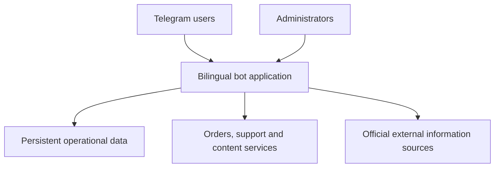

# High-Level Architecture

The public diagram intentionally describes responsibilities without revealing deployable source, credentials, network addresses, database definitions, or service configuration.

## Responsibility boundaries

| Area | Responsibility |
|---|---|
| Telegram interface | User onboarding, navigation, input validation, and administrator actions |
| Application services | Orders, payment review, content delivery, tickets, exam workflows, and notifications |
| Persistent data | Users, roles, orders, states, audits, delivery records, and runtime settings |
| External integration | Official-source retrieval with validation, caching, and safe no-data behaviour |
| Operations | Managed services, backup, integrity validation, monitoring, and rollback |

## Design principles

- Preserve existing records during every release.
- Never invent external availability or exam dates.
- Keep administrator actions attributable and reviewable.
- Prevent duplicate content delivery and repeated order side effects.
- Treat credentials, customer information, and operational topology as private.
